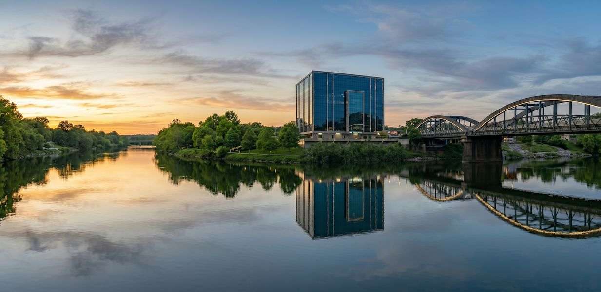

<main class="mx-auto max-w-7xl px-4 py-8">

 <!-- Hero -->


{{ pageHero(title, description) }}

 <!-- Overview Section -->
 <section class="mx-auto max-w-4xl">

 

 

 
 

 

 <h2 class="text-3xl font-bold text-gray-900 dark:text-gray-100">Welcome to Piravom</h2>
 

 Piravom is a picturesque municipal town located in the Ernakulam district of Kerala, India. Nestled on the banks of the Muvattupuzha River, it serves as a major commercial and cultural hub for the surrounding panchayats. Known for its lush green landscapes, historic churches and temples, and a thriving local economy, Piravom beautifully blends tradition with modernity.
 

 

 

 <!-- Quick Facts Grid -->
 

 

 
District

 
Ernakulam

 

 

 
Population

 
~25,000

 

 

 
Elevation

 
7 m (23 ft)

 

 

 
Area

 
17.43 km²

 

 

 <!-- Geography & Location -->
 

 <h2 class="text-2xl font-bold text-gray-900 dark:text-gray-100">📍 Geography &amp; Location</h2>
 

 Piravom is strategically located about 20 km southeast of Kochi (Cochin) and roughly 12 km from
 the KSEB Nagar area. It lies at the crossroads of the Ernakulam – Kottayam district border,
 making it an important transit point for travellers heading towards the hill stations of
 Idukki and Munnar. The town is surrounded by rolling hills, rubber plantations, coconut groves,
 and paddy fields.
 

 

 

 
Kochi (Cochin)

 
20 km

 
North-West

 

 

 
Kottayam

 
32 km

 
South-East

 

 

 
Munnar

 
90 km

 
East

 

 

 

 <!-- History -->
 

 <h2 class="text-2xl font-bold text-gray-900 dark:text-gray-100">📜 History &amp; Heritage</h2>
 

 Piravom has a rich history dating back centuries. The region was once part of the
 <strong class="text-gray-900 dark:text-gray-100">Kingdom of Travancore</strong> and later the
 <strong class="text-gray-900 dark:text-gray-100">Princely State of Cochin</strong>. Its name is believed to be
 derived from "Piravum" meaning "that which is born" - referencing its origin as a settlement
 that grew around the riverbanks.
 

 

 The town is home to several historically significant religious sites, including the
 <strong class="text-gray-900 dark:text-gray-100">Pazhoor Padippura</strong> (ancient stone-built entrance),
 the <strong class="text-gray-900 dark:text-gray-100">Magi Church</strong> (one of the oldest Catholic churches
 in the region), and numerous temples that showcase traditional Kerala architecture.
 

 

 <!-- Culture & Demographics -->
 

 <h2 class="text-2xl font-bold text-gray-900 dark:text-gray-100">🙏 Culture &amp; Community</h2>
 

 Piravom is a vibrant mosaic of cultures, with a harmonious mix of Hindu, Christian, and
 Muslim communities. The town is known for its grand festival celebrations - the
 <strong class="text-gray-900 dark:text-gray-100">Piravom Church Feast</strong> (Feast of St. Mary),
 temple <em>poorams</em>, and <em>padayani</em> performances draw visitors from across
 the district.
 

 

 Malayalam
 English
 Hindi
 Tamil
 

 

 <!-- Economy -->
 

 <h2 class="text-2xl font-bold text-gray-900 dark:text-gray-100">🏪 Economy &amp; Commerce</h2>
 

 Piravom serves as a major commercial centre for nearby villages. The town's economy is
 driven by:
 

 

 

 🌴
 

 
Agriculture

 
Rubber, coconut, arecanut, tapioca

 

 

 

 🏪
 

 
Retail &amp; Trade

 
Shops, textiles, groceries &amp; more

 

 

 

 🏦
 

 
Banking &amp; Finance

 
Multiple nationalised &amp; co-op banks

 

 

 

 🚚
 

 
Transport &amp; Logistics

 
Key transit hub for goods &amp; people

 

 

 

 

 <!-- Tourism -->
 

 <h2 class="text-2xl font-bold text-gray-900 dark:text-gray-100">🏞️ Tourism &amp; Landmarks</h2>
 

 Piravom and its surroundings offer a variety of attractions for nature lovers and pilgrims alike:
 

 

 

 🌊
 

 
Areekkal Waterfalls

 
A scenic waterfall amidst lush greenery, 10.8 km from town.

 

 

 

 🌉
 

 
Pazhoor Hanging Bridge

 
A suspension bridge over the Muvattupuzha River with stunning views.

 

 

 

 ⛰️
 

 
Mandalam Mount &amp; Koorumala

 
Hilltop viewpoints offering panoramic vistas of the region.

 

 

 

 ⛪
 

 
Magi Church &amp; Pazhoor Padippura

 
Centuries-old religious sites with architectural beauty.

 

 

 

 

 <a href="/attractions/" class="inline-flex items-center gap-2 rounded-xl bg-indigo-600 dark:bg-indigo-700 px-5 py-3 text-sm font-semibold text-white transition hover:bg-indigo-700 dark:hover:bg-indigo-600">
 Explore All Attractions
 
 </a>
 

 

 <!-- Transportation -->
 

 <h2 class="text-2xl font-bold text-gray-900 dark:text-gray-100">🚌 Transportation</h2>
 

 Piravom is well-connected by road. The <strong class="text-gray-900 dark:text-gray-100">Main Central (MC) Road</strong>
 (SH-1) passes through the town, linking it to Ernakulam, Kottayam, and beyond. Frequent
 <strong class="text-gray-900 dark:text-gray-100">KSRTC</strong> and private bus services operate from the
 Piravom bus stand, connecting to major cities and nearby towns. The nearest railway stations
 are at <strong class="text-gray-900 dark:text-gray-100">Ernakulam</strong> (20 km) and
 <strong class="text-gray-900 dark:text-gray-100">Kottayam</strong> (32 km), and the nearest airport is
 <strong class="text-gray-900 dark:text-gray-100">Cochin International Airport</strong> (COK) at Nedumbassery,
 approximately 30 km away.
 

 

 <a href="/bus-timing/" class="inline-flex items-center gap-2 rounded-xl border border-gray-200 dark:border-gray-700 bg-white dark:bg-gray-800 px-5 py-3 text-sm font-semibold text-gray-700 dark:text-gray-300 transition hover:bg-gray-50 dark:hover:bg-gray-700">
 View Bus Timings
 
 </a>
 

 

 <!-- Education -->
 

 <h2 class="text-2xl font-bold text-gray-900 dark:text-gray-100">🎓 Education</h2>
 

 Piravom is home to several well-regarded educational institutions, including
 <strong class="text-gray-900 dark:text-gray-100">St. Joseph's Higher Secondary School</strong>,
 <strong class="text-gray-900 dark:text-gray-100">N.S.S. Higher Secondary School</strong>, and
 <strong class="text-gray-900 dark:text-gray-100">Magi Carmel Higher Secondary School</strong>.
 The town also hosts engineering and arts colleges in its vicinity, making it a
 small but significant educational hub in the region.
 

 

 </section>

</main>
